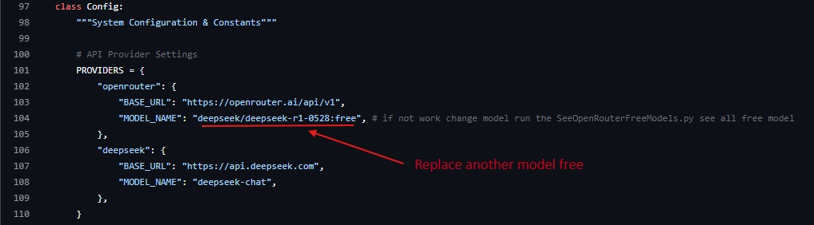

***

<div align="center">

  # HexSecGPT

  <p>
    <strong>An advanced AI framework, engineered to explore the frontiers of language model interactions.</strong>
  </p>
   
  <h4>
    <a href="https://github.com/hexsecteam/">GitHub</a>
    <span> · </span>
    <a href="https://www.instagram.com/hex.sec/">Instagram</a>
    <span> · </span>
    <a href="https://www.youtube.com/@hex_sec">YouTube</a>
  </h4>
</div>

---

## 🚀 Showcase

Here is a glimpse of the HexSecGPT framework in action.


---

## :notebook_with_decorative_cover: Table of Contents

- [About The Project](#star2-about-the-project)
  - [What is this Repository?](#grey_question-what-is-this-repository)
  - [The Real HexSecGPT: Our Private Model](#gem-the-real-HexSecGPT-our-private-model)
- [Features](#dart-features)
- [Getting Started](#electric_plug-getting-started)
  - [Prerequisites: API Key](#key-prerequisites-api-key)
  - [Installation](#gear-installation)
- [Configuration](#wrench-configuration)
- [Usage](#eyes-usage)
- [Contributing](#wave-contributing)
- [License](#warning-license)

---

## :star2: About The Project

HexSecGPT is designed to provide powerful, unrestricted, and seamless AI-driven conversations, pushing the boundaries of what is possible with natural language processing.

### :grey_question: What is this Repository?

This repository contains an open-source framework that demonstrates the *concept* of HexSecGPT. It utilizes external, third-party APIs from providers like **OpenRouter** or **DeepSeek** and combines them with a specialized system prompt. This allows a standard Large Language Model (LLM) to behave in a manner similar to our private HexSecGPT, offering a preview of its capabilities.

**It is important to understand:** This code is a wrapper and a proof-of-concept, not the core, fine-tuned HexSecGPT model itself.

### :gem: The Real HexSecGPT: Our Private Model

While this repository offers a glimpse into HexSecGPT's potential, our flagship offering is a **privately-developed, fine-tuned Large Language Model.**

Why choose our private model?
- **Ground-Up Development:** We've trained our model using advanced techniques similar to the DeepSeek methodology, focusing on pre-training, Supervised Fine-Tuning (SFT), and Reinforcement Learning (RL).
- **Superior Performance:** The private model is significantly more intelligent, coherent, and capable than what can be achieved with a simple system prompt on a public API.
- **Enhanced Security & Privacy:** Offered as a private, managed service to ensure security and prevent misuse.
- **True Unrestricted Power:** Built from the core to handle a wider and more complex range of tasks without the limitations of public models.

#### How to Access the Private Model

Access to our private model is exclusive. To inquire about services and pricing, please contact our team via Telegram.

➡️ **Join our Telegram Channel for more info:** [https://t.me/hexsec_tools](https://t.me/hexsec_tools)

---

## :dart: Features

- **Powerful AI Conversations:** Get intelligent and context-aware answers to your queries.
- **Unrestricted Framework:** A system prompt designed to bypass conventional AI limitations.
- **Easy-to-Use CLI:** A clean and simple command-line interface for smooth interaction.
- **Cross-Platform:** Tested and working on Kali Linux, Ubuntu, and Termux.

---

## :electric_plug: Getting Started

Follow these steps to get the HexSecGPT framework running on your system.

### :key: Prerequisites: API Key

To use this framework, you **must** obtain an API key from a supported provider. These services offer free tiers that are perfect for getting started.

1.  **Choose a provider:**
    *   **OpenRouter:** Visit [OpenRouter.ai](https://openrouter.ai/keys) to get a free API key. They provide access to a variety of models.
    *   **DeepSeek:** Visit the [DeepSeek Platform](https://platform.deepseek.com/api_keys) for a free API key to use their powerful models.

2.  **Copy your API key.** You will need to paste it into the script when prompted during the first run.

### :gear: Installation

We provide simple, one-command installation scripts for your convenience.

#### **Windows**
1. Download the `install.bat` script from this repository.
2. Double-click the file to run it. It will automatically clone the repository and install all dependencies.

#### **Linux / Termux**
1. Open your terminal.
2. Run the following command. It will download the installer, make it executable, and run it for you.
   ```bash
   bash <(curl -s https://raw.githubusercontent.com/hexsecteam/HexSecGPT/main/install.sh)
   ```

<details>
<summary>Manual Installation (Alternative)</summary>

If you prefer to install manually, follow these steps.

1.  **Clone the repository:**
    ```bash
    git clone https://github.com/hexsecteam/HexSecGPT.git
    ```
2.  **Navigate to the directory:**
    ```bash
    cd HexSecGPT
    ```
3.  **Install Python dependencies:**
    ```bash
    pip install -r requirements.txt
    ```
</details>

---

## :wrench: Configuration

You can easily switch between API providers.

1.  Open the `HexSecGPT.py` file in a text editor.
2.  Locate the `API_PROVIDER` variable at the top of the file.
3.  Change the value to either `"openrouter"` or `"deepseek"`.

    ```python
    # HexSecGPT.py

    # Change this value to "deepseek" or "openrouter"
    API_PROVIDER = "openrouter" 
    ```
4. Save the file. The script will now use the selected provider's API.
---
## 📽️ Demo Setup

▶️ YouTube Demo:  
[https://www.youtube.com/watch?v=EM08JC4Mv6c](https://www.youtube.com/watch?v=EM08JC4Mv6c)
## :eyes: Usage

Once installation and configuration are complete, run the application with this simple command:

```bash
python3 HexSecGPT.py
```

The first time you run it, you will be prompted to enter your API key. It will be saved locally for future sessions.

---

## 🔄 Model Compatibility & Troubleshooting (OpenRouter)

Some OpenRouter models may become unavailable, restricted, or stop working over time.

To handle this, the repository includes a model discovery script that helps you identify which FREE OpenRouter models are currently available.

### ⚠️ If the AI chat is not working

1. Open the SeeOpenRouterFreeModels.py script included in the repository  
2. Insert your own OpenRouter API key into the script  
3. Run the script python SeeOpenRouterFreeModels.py
4. The script will list all currently available FREE models  
5. Choose one of the working models from the output  

### 🔧 Update the provider configuration

- Navigate to the provider file in the source code HexSecGPT.py
- Replace the existing model name with one of the working free models  



- Save the file and restart the application  

> ⚠️ Note: Some free models may not work correctly or may be temporarily disabled by OpenRouter.  
> If a model fails, simply try another one from the list.

This method ensures better compatibility and keeps the project functional even when OpenRouter updates, limits, or removes models.


